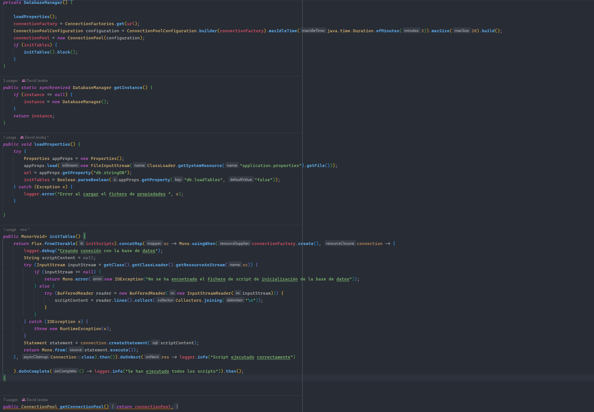
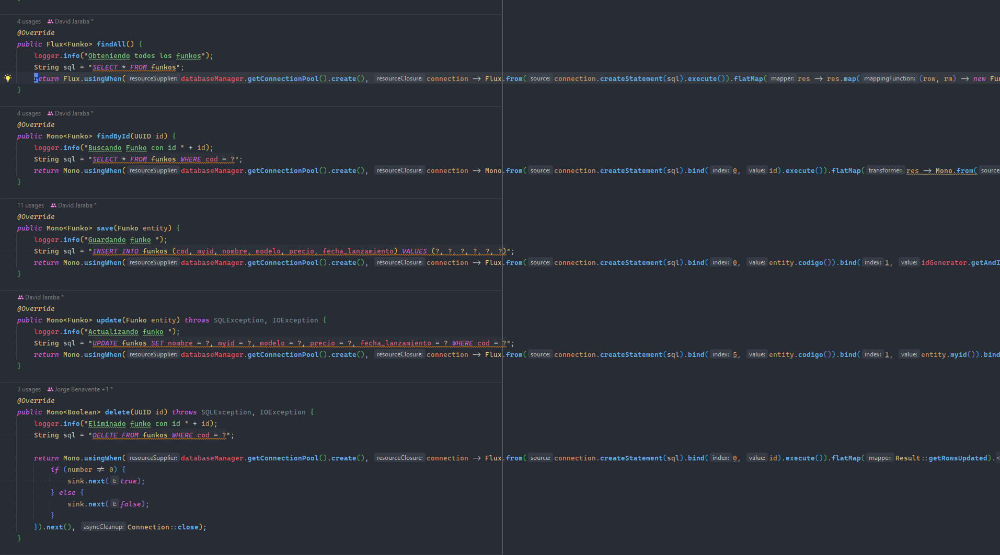
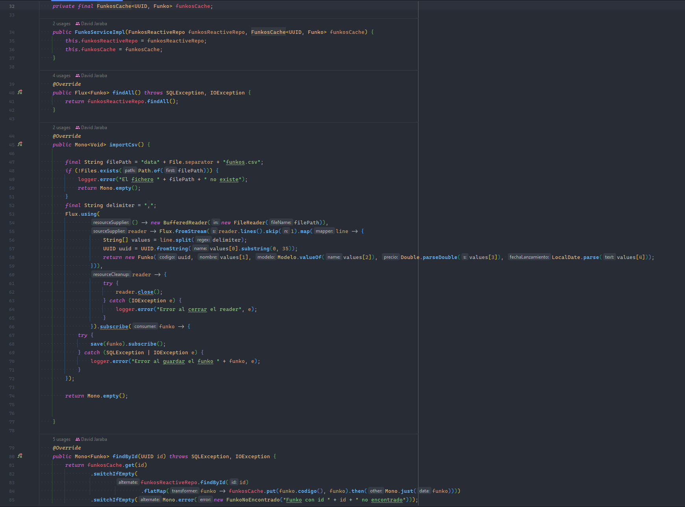
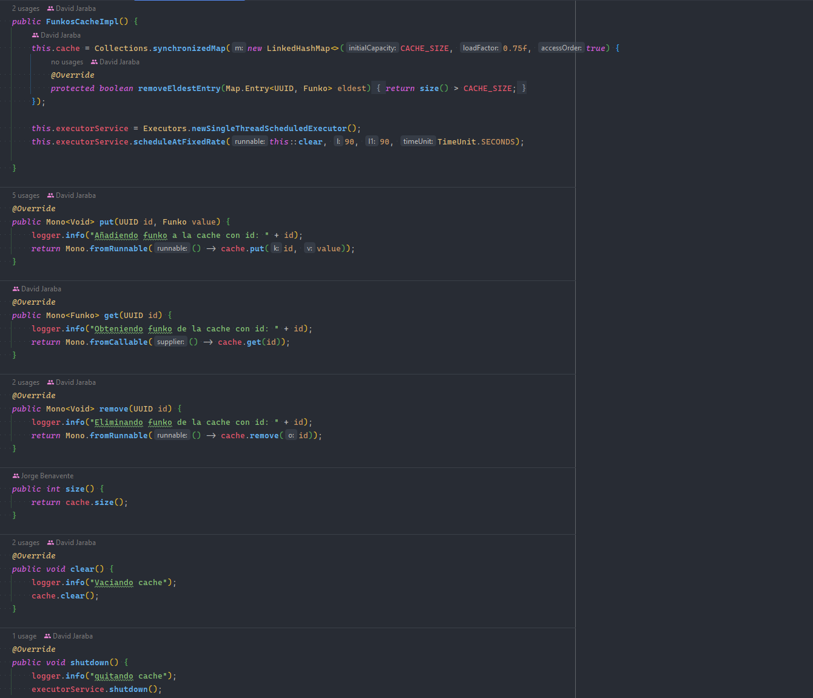
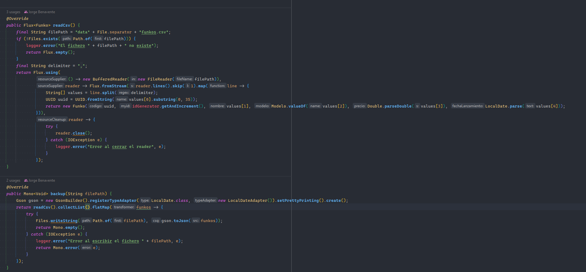
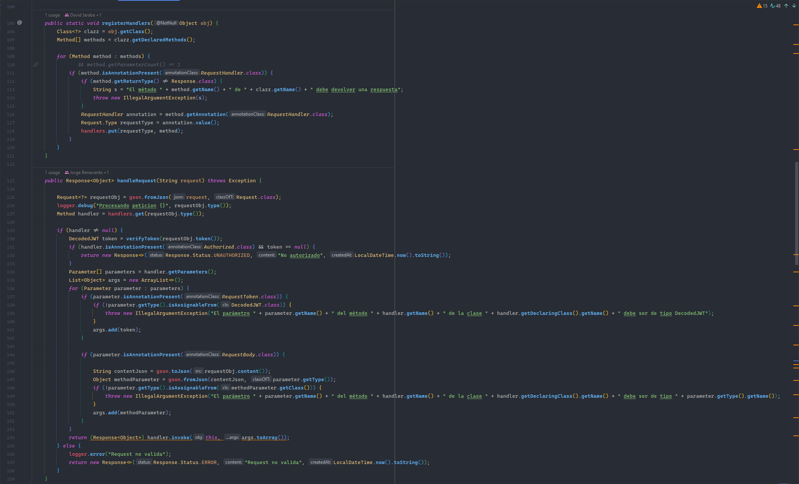

# PRÁCTICA SERVIDOR SSL/TLS FUNKOS

## Autores

* David Jaraba Pascual
* Jorge Benavente Liétor

## Requisitos

- Java 17 o superior
- Gradle
- Fichero CSV seperadado por `,` con nombre `funkos.csv` en la carpeta `data` que contenga la información de los
  pokemons.

## Enlace al vídeo
[Enlace](https://www.youtube.com/watch?v=wYvzyb0xYQc)

## Configuración

Obtiene los datos de conexión de la base datos del fichero **applicaction.properties**  que tiene este formato:

```properties
db.username=sa
db.password=1234
db.name=default
db.loadTables=true
db.stringDB=r2dbc:h2:file:///./funkos_db?options=DB_CLOSE_DELAY=-1;DB_CLOSE_ON_EXIT=FALSE
```

En el cuál también se puede indicar el fichero SQL que quieres que te cargue para inicializar la base datos.

## Estructura del proyecto

Este proyecto está basado en una arquitectura en capas que se divide en:

- **Capa de datos**: Que se compone de los modelos [Funko](src/main/java/dev/database/models/Funko.java) y del tipo
  enumerado [Modelo](src/main/java/dev/database/models/Modelo.java), de la
  clase [DatabaseManager](src/main/java/dev/services/database/DatabaseManager.java) que se encarga de enviar los
  comandos a la base de datos de forma reactiva utilizando el conector r2dbc y una pool de conexiones y la
  clase [FunkosRepository](src/main/java/dev/repositories/FunkosReactiveRepoImpl.java) que se encarga de convertir los
  POJO en comandos SQL.
  
  
- **Capa de servicios**: Que se compone de las
  clases [FunkosService](src/main/java/dev/services/funko/FunkoServiceImpl.java) que
  se encarga de gestionar los datos de los
  funkos que utiliza una [cache](src/main/java/dev/services/cache/FunkosCacheImpl.java) para ahorrar
  consultas, [FunkoAlmacenamientoService](src/main/java/dev/services/funko/FunkoAlmacenamientoServiceImpl.java) que se
  encarga de importar los Funkos desde el csv de datos y de exportar un backup en formato JSON.
  
  
  
- **Capa de controladores**: Que se compone de la clase [ClientHandler](src/main/java/dev/server/ClientHandler.java) que
  utiliza reflection para gestionar las peticiones automáticamente.
    
